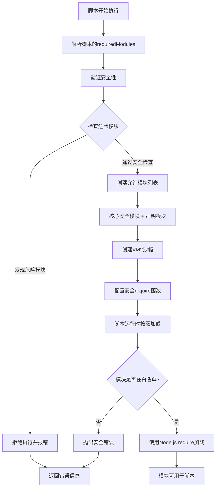

# FourAir脚本开发规范文档 v2.0

## 1. 概述

本文档基于FourAir v2.0服务层重构后的架构，详细说明脚本插件的开发格式、规范和最佳实践。所有脚本都在VM2安全沙箱中执行，具有严格的安全限制和标准化的API接口。

## 2. 脚本基本结构

### 2.1 必需的文件结构
每个脚本文件必须包含以下基本结构：

```javascript
/**
 * 脚本元数据注释
 * 功能：描述脚本的主要功能
 * 作者：作者名称
 * 版本：1.0.0
 * 更新：YYYY-MM-DD
 */

// 1. 配置函数 - 必需
function getConfig() {
  return {
    // 基本信息
    id: "unique_script_id",
    name: "脚本显示名称",
    description: "脚本功能详细描述",
    version: "1.0.0",
    author: "作者名",
    category: "工具类别",
    icon: "fas fa-robot",
    
    // 依赖声明
    requires: {
      wallets: true,  // 是否需要钱包 (true/false)
      proxy: false    // 是否强制需要代理 (true/false)  
    },
    
    // 模块声明 - 重要！必须声明所有使用的Node.js模块
    requiredModules: ["axios", "crypto"],
    
    // 支持平台
    platforms: ["通用"],
    
    // 执行超时 (毫秒，默认10分钟，最大30分钟)
    timeout: 600000,
    
    // 配置参数（可选）
    config: {
      // 参数定义...
    }
  };
}

// 2. 主执行函数 - 必需
async function main(context) {
  // 从context获取参数
  const { wallets, config, proxy, utils } = context;
  
  try {
    console.log('🚀 脚本开始执行...');
    
    // 你的脚本逻辑
    for (let i = 0; i < wallets.length; i++) {
      const wallet = wallets[i];
      console.log(`📝 处理钱包: ${wallet.address}`);
      
      // 执行业务逻辑
      await processWallet(wallet);
      
      // 进度显示
      console.log(`📊 进度: ${i + 1}/${wallets.length}`);
      
      // 延时
      await utils.delay(1000);
    }
    
    console.log('✅ 脚本执行完成');
    return { success: true, message: '执行成功' };
    
  } catch (error) {
    console.log(`❌ 脚本执行失败: ${error.message}`);
    throw error;
  }
}

// 辅助函数（可选）
async function processWallet(wallet) {
  // 钱包处理逻辑
}

// 3. 模块导出 - 必需
module.exports = {
  getConfig,
  main
};
```

## 3. Context参数详解

主函数`main(context)`接收的context对象包含以下属性：

### 3.1 基本信息
```javascript
{
  scriptId: "your_script_id",      // 脚本ID
  executionId: "exec_12345",       // 本次执行的唯一ID
}
```

### 3.2 用户数据
```javascript
{
  wallets: [                       // 用户选择的钱包列表
    {
      id: "wallet_1",
      address: "0x1234...",
      name: "钱包1",
      privateKey: "加密的私钥",     // 如果有的话
      // 其他钱包属性...
    }
  ],
  config: {                        // 用户配置的参数
    // 基于getConfig()中定义的配置项
    apiKey: "user_input_value",
    amount: 100,
    // ...
  },
  proxy: {                         // 代理配置（如果用户设置了代理）
    host: "127.0.0.1",
    port: 1080,
    type: "socks5",               // socks5 | http
    username: "用户名",           // 可选
    password: "密码"              // 可选
  } // 如果没有代理则为null
}
```

### 3.3 工具函数
```javascript
{
  utils: {
    delay: (ms) => Promise,              // 延时函数，替代setTimeout
    logger: {                            // 专用日志对象
      info: (message) => void,
      success: (message) => void,
      warn: (message) => void,
      error: (message) => void
    }
  }
}
```

### 3.4 存储系统
```javascript
{
  storage: {
    setItem: (key, value) => void,       // 存储数据（会话级别）
    getItem: (key) => value,             // 获取数据
    removeItem: (key) => void,           // 删除数据
    clear: () => void                    // 清空所有数据
  }
}
```

### 3.5 密钥管理
```javascript
{
  secrets: {
    get: async (key) => string          // 获取敏感信息（密钥、API Key等）
  }
}
```

### 3.6 HTTP客户端
```javascript
{
  http: axios,                          // axios实例，已配置代理
}
```

### 3.7 停止处理
```javascript
{
  onStop: null                          // 脚本停止时的回调函数（预留）
}
```

## 4. 模块使用规范

### 4.1 模块声明
在`getConfig()`中必须声明所有使用的Node.js模块：

```javascript
function getConfig() {
  return {
    // 其他配置...
    requiredModules: [
      "axios",      // HTTP请求
      "crypto",     // 加密相关
      "path",       // 路径处理
      "url",        // URL处理
      "util",       // 工具函数
      "ethers"      // 以太坊相关
    ]
  };
}
```

### 4.2 预装模块列表

FourAir系统已预装了丰富的Web3协议脚本开发模块，支持多链协议开发：

#### 4.2.1 Node.js核心模块（始终可用）
- `crypto` - Node.js加密模块
- `path` - 路径处理
- `url` - URL解析
- `util` - Node.js工具函数

#### 4.2.2 区块链开发核心库
- `ethers` (v6.14.3) - 以太坊开发库，功能完整
- `web3` (v4.15.0) - Web3.js主库
- `web3-utils` (v4.3.1) - Web3工具函数
- `bip39` (v3.1.0) - BIP39助记词
- `ethereumjs-wallet` (v1.0.2) - 以太坊钱包生成

#### 4.2.3 以太坊生态相关
- `@ethersproject/contracts` (v5.8.0) - 智能合约交互
- `@ethersproject/providers` (v5.8.0) - 提供者抽象
- `@ethersproject/wallet` (v5.8.0) - 钱包管理
- `@ethersproject/units` (v5.8.0) - 单位转换

#### 4.2.4 Solana生态
- `@solana/web3.js` (v1.98.2) - Solana区块链开发库

#### 4.2.5 Polkadot生态
- `@polkadot/api` (v16.1.1) - Polkadot API
- `@polkadot/util` (v13.5.1) - Polkadot工具函数
- `@polkadot/util-crypto` (v13.5.1) - Polkadot加密工具

#### 4.2.6 数学和工具库
- `bn.js` (v5.2.1) - 大数计算
- `big.js` (v6.2.2) - 高精度数学运算
- `decimal.js` (v10.4.3) - 十进制数学运算
- `moment` (v2.30.1) - 时间处理
- `uuid` (v10.0.0) - UUID生成
- `lodash` (v4.17.21) - JavaScript工具库

#### 4.2.7 数据验证和模式
- `joi` (v17.13.3) - 数据验证库
- `jsonschema` (v1.4.1) - JSON模式验证
- `semver` (v7.6.3) - 语义版本号处理

#### 4.2.8 异步流控制
- `retry` (v0.13.1) - 重试机制
- `p-limit` (v3.1.0) - 并发限制
- `p-queue` (v6.6.2) - 任务队列管理
- `ethereumjs-wallet` (v1.0.2) - 以太坊钱包工具
- `bip39` (v3.1.0) - 助记词处理

#### 4.2.4 Solana生态
- `@solana/web3.js` (v1.95.4) - Solana JavaScript SDK
- `@solana/spl-token` (v0.4.8) - Solana代币程序

#### 4.2.5 Polkadot生态
- `@polkadot/api` (v14.3.1) - Polkadot API
- `@polkadot/util` (v13.2.3) - Polkadot工具函数
- `@polkadot/util-crypto` (v13.2.3) - Polkadot加密工具
- `@polkadot/keyring` (v13.2.3) - Polkadot密钥环

#### 4.2.6 数学与数据处理
- `bn.js` (v5.2.1) - 大整数运算
- `big.js` (v6.2.2) - 精确小数运算
- `decimal.js` (v10.4.3) - 高精度十进制运算

#### 4.2.7 工具函数库
- `lodash` (v4.17.21) - JavaScript工具函数集合
- `moment` (v2.30.1) - 时间日期处理
- `uuid` (v10.0.0) - UUID生成器
- `semver` (v7.6.3) - 语义化版本处理

#### 4.2.8 数据验证与处理
- `joi` (v17.13.3) - 数据验证框架
- `jsonschema` (v1.4.1) - JSON Schema验证

#### 4.2.9 异步控制与重试
- `retry` (v0.13.1) - 重试机制
- `p-limit` (v3.1.0) - 并发限制
- `p-queue` (v6.6.2) - 异步队列

#### 4.2.10 网络请求
- `axios` (v1.9.0) - HTTP客户端（推荐使用context.http）

**禁止的危险模块**：
- `fs` - 文件系统访问
- `child_process` - 子进程
- `os` - 操作系统接口
- `net` - 网络底层接口
- `http`/`https` - 原生HTTP（请使用context.http）

### 4.3 第三方模块和依赖包处理

#### 预安装的第三方模块
系统预安装了常用的第三方模块，可直接在`requiredModules`中声明使用：

```javascript
// 常用的预安装第三方模块
requiredModules: [
  "axios",           // HTTP客户端
  "ethers",          // 以太坊开发库
  "web3",            // Web3.js
  "lodash",          // 工具函数库
  "moment",          // 时间处理
  "bignumber.js",    // 大数处理
  "crypto-js"        // 加密工具库
  ...
]
```

#### 模块使用的实际限制

基于FourAir脚本引擎的实际实现，模块使用有以下限制：

**支持的模块类型**：

1. **Node.js核心模块**（总是可用）：
   ```javascript
   requiredModules: [
     "crypto",    // 加密模块
     "path",      // 路径处理
     "url",       // URL处理  
     "util"       // 工具函数
   ]
   ```

2. **系统预装的第三方模块**：
   ```javascript
   requiredModules: [
     "ethers",    // 以太坊开发库
     "axios"      // HTTP客户端（通过context.http提供）
   ]
   ```

3. **不支持的操作**：
   - ❌ 动态安装npm包
   - ❌ 运行时下载依赖
   - ❌ 使用系统未预装的第三方库
   - ❌ 指定模块版本（如 "ethers@5.7.0"）

**如果需要使用未预装的模块**：

1. **请求系统管理员预装**：
   ```javascript
   // 如果脚本需要特定模块，需要在系统层面预装
   // 然后在脚本中声明使用
   function getConfig() {
     return {
       requiredModules: [
         "lodash",        // 需要系统预装
         "moment",        // 需要系统预装
         "bignumber.js"   // 需要系统预装
       ]
     };
   }
   ```

2. **使用替代方案**：
   ```javascript
   // 使用内置模块替代第三方库
   function getConfig() {
     return {
       requiredModules: ["crypto", "util"]
     };
   }
   
   async function main(context) {
     // 使用crypto替代其他加密库
     const crypto = require('crypto');
     const hash = crypto.createHash('sha256').update(data).digest('hex');
     
     // 使用util替代其他工具库
     const util = require('util');
     const formatted = util.format('数据: %s', data);
   }
   ```

3. **内嵌功能实现**：
   ```javascript
   // 将需要的功能直接在脚本中实现
   async function main(context) {
     // 自定义工具函数，而不是依赖外部库
     function formatCurrency(amount) {
       return new Intl.NumberFormat('zh-CN', {
         style: 'currency',
         currency: 'CNY'
       }).format(amount);
     }
   }
   ```

#### 实际的模块处理流程

根据FourAir脚本引擎的实际实现，模块处理机制如下：



**重要说明**：
1. **无动态安装**：系统不会动态安装npm包，所有模块必须是Node.js环境中已存在的
2. **预装模块**：只能使用系统预装的第三方模块（如ethers、axios等）
3. **运行时检查**：模块加载在脚本运行时通过安全的require函数进行
4. **白名单控制**：只有在`requiredModules`中声明且通过安全检查的模块才能被加载

#### 模块使用最佳实践

```javascript
function getConfig() {
  return {
    // 明确声明所有需要的模块
    requiredModules: [
      // Node.js核心模块
      "crypto",        // 加密功能
      "path",          // 路径处理
      "url",           // URL解析
      "util",          // 工具函数
      
      // 预装第三方模块（如果确定系统已预装）
      "ethers"         // 以太坊相关
      // 注意：不要声明不确定是否预装的模块
    ]
  };
}

async function main(context) {
  // 安全的模块加载和使用
  try {
    // 加载已声明的核心模块
    const crypto = require('crypto');
    const path = require('path');
    const util = require('util');
    
    console.log('✅ 核心模块加载成功');
    
    // 尝试加载第三方模块（带错误处理）
    let ethers = null;
    try {
      ethers = require('ethers');
      console.log('✅ ethers模块可用');
    } catch (ethersError) {
      console.log('⚠️ ethers模块不可用，将使用替代方案');
    }
    
    // 使用内置HTTP客户端（推荐）
    const response = await context.http.get('https://api.example.com');
    console.log('✅ 使用context.http发送请求');
    
  } catch (error) {
    console.log(`❌ 模块加载失败: ${error.message}`);
    throw error;
  }
}

// 错误处理示例：优雅降级
async function processWithFallback(context) {
  let provider = null;
  
  try {
    // 尝试使用ethers
    const { ethers } = require('ethers');
    provider = new ethers.JsonRpcProvider('https://rpc.ankr.com/eth');
    console.log('✅ 使用ethers创建provider');
    
  } catch (error) {
    // 降级到HTTP请求
    console.log('⚠️ ethers不可用，使用HTTP API替代');
    
    const rpcCall = async (method, params) => {
      return await context.http.post('https://rpc.ankr.com/eth', {
        jsonrpc: '2.0',
        method: method,
        params: params,
        id: 1
      });
    };
    
    provider = { rpcCall };
  }
  
  return provider;
}
```

### 4.4 模块使用示例
```javascript
async function main(context) {
  // 使用crypto模块
  const crypto = require('crypto');
  const hash = crypto.createHash('sha256').update('data').digest('hex');
  
  // 使用ethers
  const { ethers } = require('ethers');
  const wallet = new ethers.Wallet(privateKey);
  
  // 使用HTTP客户端（推荐）
  const response = await context.http.get('https://api.example.com/data');
}
```

## 5. 日志输出规范

### 5.1 使用console.log（推荐）
```javascript
// ✅ 推荐使用console.log，系统会自动处理
console.log('📋 普通信息');
console.log('✅ 成功信息');  
console.log('⚠️ 警告信息');
console.log('❌ 错误信息');
console.log('🚀 开始执行');
console.log('📊 进度更新');
```

### 5.2 使用专用日志对象
```javascript
async function main(context) {
  const { utils } = context;
  
  // 使用专用日志对象
  utils.logger.info('普通信息');
  utils.logger.success('成功信息');
  utils.logger.warn('警告信息');
  utils.logger.error('错误信息');
}
```

### 5.3 格式化日志输出
```javascript
// 进度显示
console.log(`📊 进度: ${current}/${total} (${Math.round(current/total*100)}%)`);

// 钱包处理
console.log(`📝 处理钱包 ${index + 1}/${wallets.length}: ${wallet.address}`);

// 网络请求
console.log(`🌐 请求API: ${url}`);

// 交易处理
console.log(`💰 发送交易: ${txHash}`);

// 时间信息
console.log(`⏰ 等待 ${seconds} 秒...`);
```

## 6. 配置参数定义

### 6.1 参数类型
```javascript
config: {
  // 文本输入
  apiKey: {
    type: "text",
    label: "API密钥",
    placeholder: "请输入API密钥",
    required: true
  },
  
  // 数字输入
  amount: {
    type: "number",
    label: "数量",
    min: 1,
    max: 1000,
    default: 10,
    required: true
  },
  
  // 多行文本
  description: {
    type: "textarea",
    label: "描述",
    rows: 4,
    placeholder: "请输入描述信息"
  },
  
  // 复选框
  enableAdvanced: {
    type: "checkbox",
    label: "启用高级模式",
    default: false
  },
  
  // 下拉选择
  network: {
    type: "select",
    label: "网络选择",
    options: [
      { value: "mainnet", label: "主网" },
      { value: "testnet", label: "测试网" }
    ],
    default: "mainnet"
  }
}
```

### 6.2 参数验证
```javascript
async function main(context) {
  const { config } = context;
  
  // 验证必需参数
  if (!config.apiKey) {
    throw new Error('API密钥不能为空');
  }
  
  // 验证数字范围
  if (config.amount < 1 || config.amount > 1000) {
    throw new Error('数量必须在1-1000之间');
  }
  
  console.log('✅ 参数验证通过');
}
```

## 7. 网络请求处理

### 7.1 使用内置HTTP客户端（推荐）
```javascript
async function main(context) {
  const { http, proxy } = context;
  
  try {
    // GET请求
    const response = await http.get('https://api.example.com/data');
    console.log(`✅ 请求成功: ${response.status}`);
    
    // POST请求
    const postResponse = await http.post('https://api.example.com/submit', {
      data: 'example'
    });
    
    // 带请求头
    const authResponse = await http.get('https://api.example.com/secure', {
      headers: {
        'Authorization': `Bearer ${context.config.apiKey}`
      }
    });
    
    return response.data;
  } catch (error) {
    console.log(`❌ 请求失败: ${error.message}`);
    throw error;
  }
}
```

### 7.2 代理自动配置
```javascript
// 系统会自动将用户设置的代理配置到http客户端
// 无需手动处理代理设置
async function main(context) {
  const { proxy } = context;
  
  if (proxy) {
    console.log(`📡 使用代理: ${proxy.type}://${proxy.host}:${proxy.port}`);
  } else {
    console.log('🌐 直接连接网络');
  }
  
  // 直接使用http客户端，代理已自动配置
  const response = await context.http.get('https://api.example.com/data');
}
```

## 8. 错误处理规范

### 8.1 标准错误处理
```javascript
async function main(context) {
  try {
    console.log('🚀 开始执行脚本...');
    
    // 参数验证
    validateParams(context.config);
    
    // 主要逻辑
    const result = await processWallets(context.wallets);
    
    console.log('✅ 脚本执行成功');
    return { success: true, data: result };
    
  } catch (error) {
    console.log(`❌ 脚本执行失败: ${error.message}`);
    
    // 根据错误类型返回不同信息
    if (error.name === 'ValidationError') {
      throw new Error(`参数错误: ${error.message}`);
    } else if (error.name === 'NetworkError') {
      throw new Error(`网络错误: ${error.message}`);
    } else {
      throw error; // 重新抛出其他错误
    }
  }
}

function validateParams(config) {
  if (!config.apiKey) {
    const error = new Error('API密钥不能为空');
    error.name = 'ValidationError';
    throw error;
  }
}
```

### 8.2 分步骤错误处理
```javascript
async function processWallets(wallets) {
  const results = [];
  let successCount = 0;
  let failCount = 0;
  
  for (let i = 0; i < wallets.length; i++) {
    try {
      console.log(`📝 处理钱包 ${i + 1}/${wallets.length}: ${wallets[i].address}`);
      
      const result = await processWallet(wallets[i]);
      results.push({ wallet: wallets[i].address, success: true, data: result });
      successCount++;
      
      console.log(`✅ 钱包 ${wallets[i].address} 处理成功`);
      
    } catch (error) {
      console.log(`❌ 钱包 ${wallets[i].address} 处理失败: ${error.message}`);
      results.push({ wallet: wallets[i].address, success: false, error: error.message });
      failCount++;
    }
  }
  
  console.log(`📊 处理完成: ${successCount} 成功, ${failCount} 失败`);
  return results;
}
```

## 9. 存储和状态管理

### 9.1 使用内置存储
```javascript
async function main(context) {
  const { storage } = context;
  
  // 存储数据
  storage.setItem('lastExecutionTime', Date.now());
  storage.setItem('processedCount', 0);
  
  // 读取数据
  const lastTime = storage.getItem('lastExecutionTime');
  if (lastTime) {
    console.log(`上次执行时间: ${new Date(lastTime).toLocaleString()}`);
  }
  
  // 更新计数
  let count = storage.getItem('processedCount') || 0;
  count++;
  storage.setItem('processedCount', count);
  
  // 清理数据
  if (count > 100) {
    storage.clear();
    console.log('🧹 清理存储数据');
  }
}
```

### 9.2 状态持久化
```javascript
// 脚本执行过程中的状态保存
async function processWithStateManagement(context) {
  const { storage, wallets } = context;
  
  // 恢复之前的进度
  let startIndex = storage.getItem('lastProcessedIndex') || 0;
  console.log(`📋 从索引 ${startIndex} 开始处理`);
  
  for (let i = startIndex; i < wallets.length; i++) {
    try {
      await processWallet(wallets[i]);
      
      // 保存进度
      storage.setItem('lastProcessedIndex', i + 1);
      
    } catch (error) {
      console.log(`❌ 处理失败，已保存进度到索引 ${i}`);
      throw error;
    }
  }
  
  // 完成后清理进度
  storage.removeItem('lastProcessedIndex');
}
```

## 10. 性能和资源管理

### 10.1 延时控制
```javascript
async function main(context) {
  const { utils, wallets } = context;
  
  for (const wallet of wallets) {
    // 处理钱包
    await processWallet(wallet);
    
    // 固定延时
    await utils.delay(1000); // 1秒延时
    
    // 随机延时（需要自己实现）
    const randomDelay = Math.random() * 2000 + 1000; // 1-3秒随机
    await utils.delay(randomDelay);
  }
}
```

### 10.2 并发控制
```javascript
// 限制并发数量
async function processWithConcurrency(wallets, maxConcurrency = 3) {
  const results = [];
  
  for (let i = 0; i < wallets.length; i += maxConcurrency) {
    const batch = wallets.slice(i, i + maxConcurrency);
    
    console.log(`📊 处理批次 ${Math.floor(i/maxConcurrency) + 1}: ${batch.length} 个钱包`);
    
    const batchPromises = batch.map(wallet => processWallet(wallet));
    const batchResults = await Promise.allSettled(batchPromises);
    
    results.push(...batchResults);
    
    // 批次间延时
    if (i + maxConcurrency < wallets.length) {
      await utils.delay(2000);
    }
  }
  
  return results;
}
```

## 11. 安全注意事项

### 11.1 沙箱限制
- 脚本在VM2沙箱中运行，无法访问文件系统
- 不能使用`setTimeout`，请使用`context.utils.delay()`
- 不能访问DOM或窗口对象
- 模块加载受到严格限制

#### 时间处理特别说明
VM2沙箱环境不支持原生的`setTimeout`、`setInterval`等时间函数，必须使用提供的工具函数：

```javascript
// ❌ 错误：在VM2沙箱中不可用
await new Promise(resolve => setTimeout(resolve, 1000));
setInterval(() => {}, 1000);

// ✅ 正确：使用context.utils.delay()
await context.utils.delay(1000);

// 如果需要传递utils到其他函数
async function processWallet(wallet, utils) {
  // 处理逻辑
  await utils.delay(500); // 使用传递的utils
}

// 在main函数中调用
await processWallet(wallet, context.utils);
```

### 11.2 敏感信息处理
```javascript
async function main(context) {
  // ✅ 正确：使用secrets获取敏感信息
  const apiKey = await context.secrets.get('myApiKey');
  
  // ❌ 错误：不要在代码中硬编码敏感信息
  // const apiKey = "sk-1234567890abcdef";
  
  // ✅ 正确：不要在日志中输出敏感信息
  console.log('🔑 已获取API密钥');
  
  // ❌ 错误：不要输出密钥内容
  // console.log(`API密钥: ${apiKey}`);
}
```

### 11.3 错误信息安全
```javascript
try {
  const response = await context.http.post('/api/login', {
    username: wallet.address,
    password: secretKey
  });
} catch (error) {
  // ✅ 正确：过滤敏感信息
  const safeMessage = error.message.replace(/password[^&]*/gi, 'password=[隐藏]');
  console.log(`❌ 登录失败: ${safeMessage}`);
}
```

## 12. 测试和调试

### 12.1 本地测试结构
```javascript
// 添加测试数据生成函数
function generateTestContext() {
  return {
    scriptId: "test_script",
    executionId: "test_exec_123",
    wallets: [
      { id: "1", address: "0x1234...", name: "测试钱包1" }
    ],
    config: {
      apiKey: "test_key",
      amount: 10
    },
    proxy: null,
    utils: {
      delay: (ms) => new Promise(resolve => setTimeout(resolve, ms)),
      logger: {
        info: console.log,
        success: console.log,
        warn: console.warn,
        error: console.error
      }
    },
    storage: {
      _data: {},
      setItem: function(k, v) { this._data[k] = v; },
      getItem: function(k) { return this._data[k]; },
      removeItem: function(k) { delete this._data[k]; },
      clear: function() { this._data = {}; }
    },
    secrets: {
      get: async (key) => `test_secret_${key}`
    },
    http: require('axios')
  };
}

// 测试主函数
if (require.main === module) {
  // 本地测试代码
  (async () => {
    try {
      const testContext = generateTestContext();
      const result = await main(testContext);
      console.log('测试结果:', result);
    } catch (error) {
      console.error('测试失败:', error);
    }
  })();
}
```

### 12.2 调试日志
```javascript
async function main(context) {
  // 开发阶段：输出context信息
  console.log('🔍 Context信息:');
  console.log(`- 脚本ID: ${context.scriptId}`);
  console.log(`- 执行ID: ${context.executionId}`);
  console.log(`- 钱包数量: ${context.wallets.length}`);
  console.log(`- 配置参数: ${JSON.stringify(context.config)}`);
  console.log(`- 代理设置: ${context.proxy ? '已设置' : '未设置'}`);
  
  // 验证关键参数
  if (!context.wallets || context.wallets.length === 0) {
    throw new Error('没有可用的钱包');
  }
  
  // 继续执行...
}
```

## 13. 完整示例

```javascript
/**
 * 示例脚本：代币余额查询
 * 功能：查询多个钱包的ERC20代币余额
 * 作者：开发团队
 * 版本：1.0.0
 */

function getConfig() {
  return {
    id: "token_balance_checker",
    name: "代币余额查询",
    description: "批量查询钱包的ERC20代币余额",
    version: "1.0.0",
    author: "开发团队",
    category: "查询工具",
    icon: "fas fa-search-dollar",
    
    requires: {
      wallets: true,
      proxy: false
    },
    
    requiredModules: ["axios", "ethers"],
    
    config: {
      tokenAddress: {
        type: "text",
        label: "代币合约地址",
        placeholder: "请输入ERC20代币合约地址",
        required: true
      },
      rpcUrl: {
        type: "text",
        label: "RPC节点地址",
        default: "https://rpc.ankr.com/eth",
        required: true
      }
    }
  };
}

async function main(context) {
  const { wallets, config, utils } = context;
  
  try {
    console.log('🚀 开始查询代币余额...');
    console.log(`📋 代币地址: ${config.tokenAddress}`);
    console.log(`📋 钱包数量: ${wallets.length}`);
    
    // 验证参数
    if (!config.tokenAddress || !config.rpcUrl) {
      throw new Error('代币地址和RPC地址不能为空');
    }
    
    const { ethers } = require('ethers');
    
    // 创建provider
    const provider = new ethers.JsonRpcProvider(config.rpcUrl);
    
    // ERC20 ABI (简化版)
    const erc20Abi = [
      "function balanceOf(address owner) view returns (uint256)",
      "function decimals() view returns (uint8)",
      "function symbol() view returns (string)"
    ];
    
    // 创建合约实例
    const contract = new ethers.Contract(config.tokenAddress, erc20Abi, provider);
    
    // 获取代币信息
    console.log('📡 获取代币信息...');
    const [symbol, decimals] = await Promise.all([
      contract.symbol(),
      contract.decimals()
    ]);
    
    console.log(`💰 代币: ${symbol}, 精度: ${decimals}`);
    
    const results = [];
    
    // 查询每个钱包余额
    for (let i = 0; i < wallets.length; i++) {
      const wallet = wallets[i];
      
      try {
        console.log(`📝 查询钱包 ${i + 1}/${wallets.length}: ${wallet.address}`);
        
        const balance = await contract.balanceOf(wallet.address);
        const formattedBalance = ethers.formatUnits(balance, decimals);
        
        results.push({
          address: wallet.address,
          name: wallet.name,
          balance: formattedBalance,
          symbol: symbol,
          success: true
        });
        
        console.log(`✅ ${wallet.name}: ${formattedBalance} ${symbol}`);
        
      } catch (error) {
        console.log(`❌ 查询失败 ${wallet.address}: ${error.message}`);
        results.push({
          address: wallet.address,
          name: wallet.name,
          error: error.message,
          success: false
        });
      }
      
      // 进度显示
      console.log(`📊 进度: ${i + 1}/${wallets.length} (${Math.round((i + 1)/wallets.length*100)}%)`);
      
      // 延时
      await utils.delay(1000);
    }
    
    // 统计结果
    const successCount = results.filter(r => r.success).length;
    const failCount = results.length - successCount;
    
    console.log(`📊 查询完成: ${successCount} 成功, ${failCount} 失败`);
    console.log('✅ 脚本执行完成');
    
    return {
      success: true,
      message: '余额查询完成',
      data: {
        token: { address: config.tokenAddress, symbol, decimals },
        results: results,
        summary: { total: results.length, success: successCount, failed: failCount }
      }
    };
    
  } catch (error) {
    console.log(`❌ 脚本执行失败: ${error.message}`);
    throw error;
  }
}

module.exports = {
  getConfig,
  main
};
```

---

## 总结

遵循本规范可以确保您的脚本：
1. ✅ 在安全沙箱中正常运行
2. ✅ 正确接收和处理参数
3. ✅ 友好的日志输出和错误处理
4. ✅ 符合FourAir v2.0架构标准
5. ✅ 具有良好的用户体验

如有疑问，请参考项目中的示例脚本或联系开发团队。 